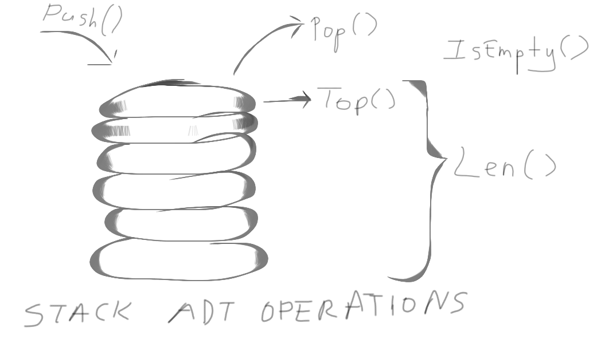

# Golang


---------------------------------------------------------------------

# Stacks

* Stacks are one of the fundamental data structures in computer science.
* They are linear data structures.
* Working principle of stacks is LIFO (Last in first out).


* ADT (Abstract Data Type) operations of stacks are:
* 1. Push()
* 2. Pop()
* 3. Len()
* 4. IsEmpty()
* 5. Top()

----------------------------------------------------------
## Time complexities of ADT operations

| **Operation** | **Complexity** |
| ------------- | -------------- |
| Q.Push(e)     | O(1)*          |
| Q.Pop()       | O(1)*          |
| Q.Top()       | O(1)           |
| Q.IsEmpty()   | O(1)           |
| Q.Len()       | O(1)           |

* Why Push and Pop operations are **amortized**?
* Because, these operations can cause reallocation (extension or shrinkage) on slices.



------------------------------------------------------------

## Example usage

```go
S := new(Stack)
fmt.Println("empty? ", S.IsEmpty())
S.Push("cat")
S.Push(1999)
S.Push("Car")
S.Push(11.111)
S.Push(true)
fmt.Println(S.Show())
fmt.Println("len(S) ", S.Len())
fmt.Println("pop ", S.Pop())
fmt.Println("pop ", S.Pop())
fmt.Println(S.Show())
fmt.Println("len(S) ", S.Len())
fmt.Println("top ", S.Top())
fmt.Println("empty? ", S.IsEmpty())
```

```[console]
empty?  true
[cat 1999 Car 11.111 true]
len(S)  5
pop  true
pop  11.111
[cat 1999 Car]
len(S)  3
top  Car
empty?  false
```
--------------------------------------------------

## Implementation

* In implementation, slice is used to store data.
* As the type that are going to store in stack structure, **interface** is used.
* All of the ADT operations are implemented. Moreover, **Show()** function is explemented as an extra to show whole data stored in stack.
* In order to overcome data errors, **sync.Mutex** is used to applying functions concurrently.
* Whole code implementation can be seen in **Stacks/Stacks.go**.
------------------------------------------------------

## Licence

MIT
